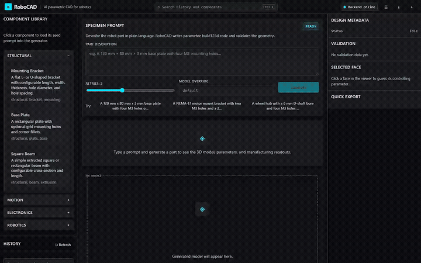

# 🤖 RoboCAD — AI-Powered Parametric CAD for Robotics

> **Mission:** Let robotics builders design real, editable, manufacturable hardware parts by describing them in plain language — no months of sketch-extrude-mate training required.
>
> **Core bet:** The AI writes **parametric CAD code** (build123d / FeatureScript), not throwaway meshes. The model you get is editable, versionable, and exportable for 3D printing, machining, or Onshape.
>
> **Latest milestone:** Phases 14A, 14B, 15A, and **15B are complete**. RoboCAD can export any part or assembly to a simulation-ready bundle (MJCF/URDF/STL/inertial), drop it into one of four standard manipulation scenes, and verify a 10-second MuJoCo stability rollout via the `LearningRobotics` handshake. Phase 15B adds the `RoboCompiler` asset pipeline: skill-to-scene recommendation (`recommend-skill`), automatic part variant sweeps (`variant-sweep`), and a trainable push-policy smoke test (`train-skill`) using a tiny NumPy-only CEM policy that pushes a block into the goal zone on a generated wedge mesh. The backend exposes `POST /designs/{id}/simulate`, `POST /designs/{id}/scene`, `POST /designs/{id}/handshake`, `GET /capabilities`, `POST /designs/{id}/recommend-skill`, `POST /designs/{id}/train-skill`, `GET /designs/{id}/skills`, `POST /designs/{id}/variant-sweep`, and download endpoints; the Kinetic Precision frontend has `SimulatePanel` with tabs for bundle, skill training, and variant sweep. Phase 13 remains green on the T1–T4 ≥80% quality gate with Claude 5 fully integrated. Full pytest suite: **187 passed**. Phase 16 — voice/text + sketch input — is next.

---

## 🧑‍💻 Author

**Satyam Das** — CS grad, quant/AI engineer, aspiring roboticist.

* GitHub: [@satyamdas03](https://github.com/satyamdas03)
* Sister project: [LearningRobotics](https://github.com/satyamdas03/LearningRobotics) — where the theory behind these parts is learned chapter by chapter.
* Motto: *"Think in systems, design in language, build in hardware."*

---

## 🔗 Why this exists / connection to LearningRobotics

`LearningRobotics` is a public learning journal that walks through robotics fundamentals — C-space, rigid-body motions, kinematics, dynamics, and eventually control + RL. The natural next step after *understanding* a robot is to *build* it. But professional CAD has a steep activation energy: weeks of UI muscle memory before you can express a simple idea like:

> *"A 120 mm × 80 mm × 3 mm base plate with four M3 mounting holes on a 100 mm × 60 mm grid and two NEMA-17 motor mounts."*

RoboCAD closes that gap. It lets me (and anyone else) operate at the level of intent, not clicks. Designs produced here can be:

1. Printed or machined directly (STL / STEP / 3MF export).
2. Synced to Onshape later for professional assemblies and mates (Phase 5).
3. Reused as parts in `LearningRobotics` simulations and hardware builds.

In short: **LearningRobotics teaches the robot. RoboCAD designs the parts.**

---

## ✨ What makes this different

| Tool category | Examples | Output | Editable? | Manufacturable? |
|---|---|---|---|---|
| Text-to-mesh | Meshy, Shap-E | mesh (STL-like) | ❌ no | ⚠️ limited |
| Text-to-SDF/voxel | research demos | implicit field | ❌ no | ❌ no |
| Parametric template filling | Onshape configs | existing parametric model | ✅ yes | ✅ yes |
| **RoboCAD (this repo)** | **LLM → build123d code → feature tree** | **parametric CAD script** | **✅ yes** | **✅ yes** |

The key insight: **CAD is code.** Modern parametric kernels (OpenCASCADE via build123d/CADQuery, Onshape's FeatureScript) are programming environments. LLMs are already excellent at code generation. RoboCAD turns hardware design into a code-generation + execution problem, which is exactly the right shape for an AI researcher.

---

## 🏗️ Architecture

```
┌─────────────────────────────────────────────────────────────┐
│  User layer                                                 │
│  • natural-language prompt                                  │
│  • parameter sliders / stylus reference points              │
│  • design history + remix                                   │
└───────────────────────┬─────────────────────────────────────┘
                        │
                        ▼
┌─────────────────────────────────────────────────────────────┐
│  AI orchestrator (Claude / GPT-4 + structured output)       │
│  • intent parsing (chassis, bracket, gripper, pulley...)    │
│  • emits parametric build123d / FeatureScript code          │
│  • self-corrects on execution / validation failures         │
│  • explains what it built and why                           │
└───────────────────────┬─────────────────────────────────────┘
                        │
                        ▼
┌─────────────────────────────────────────────────────────────┐
│  CAD execution engine                                       │
│  • build123d / CADQuery (local, Phase 0–4)                │
│  • optional Onshape REST API + FeatureScript (Phase 5)    │
└───────────────────────┬─────────────────────────────────────┘
                        │
                        ▼
┌─────────────────────────────────────────────────────────────┐
│  Geometry validation layer                                  │
│  • build success / traceback capture                        │
│  • watertight / manifold check (manifold3d / trimesh)       │
│  • bounding-box, mass, CoM sanity                            │
│  • manufacturability hints (overhangs, fastener clearances) │
└───────────────────────┬─────────────────────────────────────┘
                        │
                        ▼
┌─────────────────────────────────────────────────────────────┐
│  Viewer + edit layer                                        │
│  • web-based 3D viewer (three.js / react-three-fiber)       │
│  • expose named parameters from generated code              │
│  • point-and-type dimension editing (v1)                    │
└───────────────────────┬─────────────────────────────────────┘
                        │
                        ▼
┌─────────────────────────────────────────────────────────────┐
│  Persistence + reuse                                          │
│  • design = {prompt, code, parameters, exports, versions}   │
│  • searchable library                                         │
│  • remix: old design becomes seed for new prompt              │
└─────────────────────────────────────────────────────────────┘
```

---

## 🛠️ Tech stack

| Layer | Technology | Rationale |
|---|---|---|
| CAD kernel | **build123d** | Clean Python API on OpenCASCADE; LLMs write it well; open-source |
| Mesh validation | `trimesh`, `manifold3d` | Watertight checks, mass properties |
| AI model | Claude / GPT-4 via API | Best-in-class code generation and self-correction |
| Backend (Phase 2+) | FastAPI | Python-native, easy to invoke build123d |
| Frontend (Phase 2+) | React + three.js / react-three-fiber | Standard web 3D viewer |
| Storage | SQLite + JSON files + Git | Simple, versioned, portable |
| Export formats | STL, STEP, 3MF | 3D printing + machining + Onshape |
| Onshape sync (Phase 5) | Onshape REST API + FeatureScript | Professional assemblies and mates |

---

## 🚀 Current phase

| Phase | Goal | Status |
|---|---|---|
| **0** | Validate the AI → parametric-code loop in Python | ✅ **Complete — 8/8 prompts pass** |
| **1** | Robust generation + self-correction backend | ✅ **Complete — 19/20 prompts pass (95%)** |
| **2** | Minimal web app (prompt + viewer + export) | ✅ **Complete — FastAPI + React + three.js viewer + persistence** |
| **3** | Parameter / stylus editing layer | ✅ **Complete — editable parameter panel + face-click parameter guessing + versioned regeneration** |
| **4** | Design library + remix | ✅ **Complete — component catalog, search/filter, tags, remix with parent linking** |
| **5** | Onshape export / sync + manufacturing reports | ✅ **Complete — HMAC-signed Onshape API client, STEP upload, manufacturability report (volume, overhangs, hole diameter, print-time heuristic)** |
| **6** | Robotics-aware component templates | ✅ **Complete — 12 standard robotics parts in `ComponentLibrary`, seeded prompts, tags, remix** |
| **7** | Google Stitch Kinetic Precision UI redesign | ✅ **Complete — dark scientific engineering workstation, `kp-*` token system, fixed header/sidebar/viewer/inspector layout, all components restyled, frontend builds cleanly, 56/57 tests passing, live end-to-end verified** |
| **8** | **Complexity benchmark + feature-tree spec** | ✅ **Complete — 30-prompt baseline: 26/30 (86.7%); feature-tree schema v1.0.0; new tests pass** |
| **9** | **Feature-tree backend** | ✅ **Complete — structured feature tree transpiles to build123d; `GET /designs/{id}/feature-tree` + `POST /designs/{id}/regenerate-from-feature-tree`; frontend Feature Tree panel; 97/97 tests pass** |
| **10** | **Sketch + 2D constraint solver** | ✅ **Complete — internal 2D solver for distance/horizontal/vertical/coincident/concentric/equal/fix constraints; `ai_cad/sketch_solver.py` + `tests/test_sketch_solver.py`; 105/105 tests pass** |
| **11** | **Assembly system** | ✅ **Complete — multi-part instances + LCS mates, `ai_cad/assembly.py`, assembly STEP export, `GET /designs/{id}/assembly`, `AssemblyPanel.jsx`, `tests/test_assembly.py`; 112/112 tests pass** |
| **12** | **Verification + physics layer** | ✅ **Complete — DFM rule engine (`ai_cad/dfm.py`), tolerance/fit checks (`ai_cad/tolerances.py`), cantilever-beam FEA (`ai_cad/fea.py`), backend endpoints for all three, frontend `DFMReport.jsx` / `ToleranceReport.jsx` / `FEAPanel.jsx`; 125/125 tests pass** |
| **13** | **Model specialization / fine-tuning + Claude 5 integration** | ✅ **Complete — dataset builder, Ollama Modelfile specialization, QLoRA skeleton, A/B evaluator, Anthropic SDK Claude 5 fixes; 134/134 tests pass; Claude Sonnet 5 T1–T4 87.5% (21/24), overall 21/30 (70.0%)** |
| **14A** | **GEDA Bridge: MuJoCo / URDF exporter + verified asset bundles** | ✅ **Complete — `ai_cad/geda_bridge/`, `POST /designs/{id}/simulate`, `SimulatePanel.jsx`, 152/152 tests passing, MuJoCo runtime validation** |
| **14B** | **Standard manipulation scene templates** | ✅ **Complete — `ai_cad/geda_bridge/scene_templates.py`, 4 templates, composition API, `POST /designs/{id}/scene`, `SceneTemplatePanel.jsx`, 160/160 tests passing, MuJoCo scene-load validation** |
| **15A** | **LearningRobotics handshake** | ✅ **Complete — `ai_cad/geda_bridge/loader.py`, bundle contract (`docs/BUNDLE_CONTRACT.md`), reference MuJoCo/Isaac Sim loaders, `GET /capabilities`, `POST /designs/{id}/handshake`, `CapabilitiesPanel.jsx`, 10 s wedge stability end-to-end test, 170/170 tests passing** |
| **15B** | **RoboCompiler asset pipeline** | ✅ **Complete — `ai_cad/geda_bridge/skill_recommend.py`, `skill_smoke.py`, `variant_sweep.py`, `POST /designs/{id}/recommend-skill`, `POST /designs/{id}/train-skill`, `GET /designs/{id}/skills`, `POST /designs/{id}/variant-sweep`, trainable push-policy smoke test, 187/187 tests passing** |
| **16** | Voice/text + sketch input | ⏳ Planned |
| **17** | Automatic part decomposition | ⏳ Planned |
| **18** | Per-part physical testing (FEA templates) | ⏳ Planned |
| **19** | Assembly synthesis + verification | ⏳ Planned |
| **20** | World-model simulation builder | ⏳ Planned |
| **21** | Robot brain training loop | ⏳ Planned |
| **22** | HERMES conversational supervisor | ⏳ Planned |
| **23** | Sim-to-real feedback loop | ⏳ Planned |
| **24** | Distribution + commercialization | ⏳ Planned — one-command launcher / desktop installer / SaaS tier |

Phases 0–7 proved the **AI → parametric-code loop** for single-part robotics hardware. Phases 8–13 turned that loop into an **engineer-grade CAD system** with feature trees, constraints, assemblies, verification, and model specialization. Phases 14A–24 extend RoboCAD toward the full **voice-to-CAD-to-world-model-to-robot-brain** vision, starting with the GEDA Bridge so LearningRobotics can consume verified simulation-ready assets.

### 🎯 Why we are following this exact sequence

This roadmap is the canonical plan of record for RoboCAD. **Do not reorder phases or skip ahead without explicit user approval.** Every phase is a load-bearing step:

- **Phase 13** is the quality gate. We do not build the bridge until the generator is reliably producing correct feature trees.
- **Phases 14A–15B** (PATH1) are the first commercial milestone. They prove that AI-generated CAD can be consumed by real physics simulators and create the exact bundle format that the later vision layers need.
- **Phases 16–23** (PATH2) add voice, decomposition, FEA, assembly synthesis, world models, brain training, and HERMES. These are intentionally sequenced so each hard layer is funded by earlier validation.
- **Phase 24** turns the stack into an installable product and business.

### 📋 Roadmap at a glance

| Phase | What it does | ~Time | Proof point |
|---|---|---|---|
| **13** | Benchmark to ≥80% on T1–T4, close extractor edge cases | 1–2 mo | Quality gate passed — T1–T4 87.5% with Claude Sonnet 5 |
| **14A** | MuJoCo/URDF exporter + verified asset bundles | 2–3 mo | Simulation-ready CAD |
| **14B** | Standard manipulation scene templates | 1 mo | Drop-in task templates |
| **15A** | LearningRobotics bundle handshake | 1–2 mo | Cross-repo verified handoff |
| **15B** | RoboCompiler asset pipeline | 2–3 mo | ✅ Video → custom part → trained skill smoke test; variant sweep + skill recommendation live |
| **16** | Voice/text + sketch input | 2–3 mo | Hands-free CAD edits |
| **17** | Automatic part decomposition | 3–4 mo | Robot from one prompt |
| **18** | Templated per-part physical tests | 2–3 mo | Auto stress/drop reports |
| **19** | Assembly synthesis + verification | 3–4 mo | Full robot bundle |
| **20** | World-model simulation builder | 3–4 mo | Parameterized training scene |
| **21** | Synthetic data + policy training loop | 4–6 mo | Design → trainable brain |
| **22** | HERMES conversational supervisor | 3–4 mo | Conversational design agent |
| **23** | Sim-to-real feedback loop | 6–12 mo | Real robot deployment |
| **24** | Distribution + commercialization | Ongoing | SaaS + marketplace |

### 🧭 Decision record: PATH1 before PATH2

We explicitly decided to ship **PATH1 (GEDA Bridge, Phases 14A–15B) before PATH2 (voice-to-world-model, Phases 16–23)**. The reasoning is:

1. **Risk-ordering.** PATH1 is plumbing and unit conversion; PATH2 bundles multiple unsolved research problems (decomposition, arbitrary FEA, RL training, sim-to-real).
2. **Market validation.** PATH1 addresses a visible $4–5 B market gap (CAD → MuJoCo). PATH2 markets are larger but crowded and capital-intensive.
3. **Foundation for PATH2.** PATH1 produces the bundle schema, verified asset format, and LearningRobotics API contract that every PATH2 layer depends on.
4. **Ship-first discipline.** Every phase must produce something a user or partner can run. PATH1 satisfies that immediately.

See [`PLAN.md`](PLAN.md) Section 14 for the full PATH1 vs PATH2 analysis, and [`dossiers/PATH1_PATH2_analysis.md`](dossiers/PATH1_PATH2_analysis.md) for the detailed market/technical write-up.

### ✅ How to stay on track

- Before starting any phase, confirm the previous phase's **acceptance criteria** are met and the test suite is green.
- Keep the **30-prompt complexity benchmark** green after every model or prompt change.
- Every phase ends with a commit, a pushed README/PLAN update, and (where possible) a recorded demo.
- Do not chase side quests labeled as later phases unless the current phase is fully accepted.
- When in doubt, the default action is: **finish the current phase, then move to the next one in the table above.**

See [`PLAN.md`](PLAN.md) for the complete end-to-end build plan, acceptance criteria, and dependency table.

## 🎨 UI redesign

The web interface is now a **Google Stitch *Kinetic Precision*** dark scientific engineering workstation. The design moves away from the earlier *Precision Lab Instrument* light theme into a near-black control-room aesthetic: obsidian panels, surgical cyan accent (#00e5ff), tactical amber for warnings (#feb300), `Inter` for UI chrome, and `JetBrains Mono` for all engineering readouts and parameter values. The layout is a fixed-pane workstation: instrument header, left sidebar with component library and history, large central 3D viewport, right inspector panel for metadata/validation/selected-face/quick export, and a bottom grid of manufacturing, Onshape, tags, and remix panels.

The redesign was guided by `STITCH_BRIEF.md` and the generated `stitch_precision_engineering_interface/` reference files, then implemented by hand inside the existing React component tree so that every `api.js` export, backend endpoint, STLViewer face-click raycaster, component prop contract, and `standard_components.json` schema remained intact.

Key files:
- `STITCH_BRIEF.md` — original design brief fed to Google Stitch.
- `stitch_precision_engineering_interface/` — generated reference mockups and `DESIGN.md` kept for provenance.
- `PRODUCT.md` — durable product context and current brand direction.
- `web/frontend/src/styles/index.css` — `kp-*` token system for the Kinetic Precision palette.
- `web/frontend/src/App.jsx` and all components — rebuilt in the workstation layout.
- `web/frontend/index.html` — `Inter` + `JetBrains Mono` font loading and direction contract.

---

## 🎬 UI demo — Base plate design, parameter edit, and manufacturing report

The video/GIF below shows a complete end-to-end session in the new *Kinetic Precision* UI, recorded with Playwright against the running local backend and frontend.



*Click the GIF to open the full-quality WebM version, or download it directly: [`assets/robocad_kinetic_precision_demo.webm`](assets/robocad_kinetic_precision_demo.webm)*

### What the demo shows

**0:00 — Launch and component library**
The app opens at `http://127.0.0.1:5173`. The instrument header shows the RoboCAD mark, a search shortcut, and a glowing cyan “Backend online” indicator confirming the FastAPI service on port 8000 is reachable. The left sidebar displays the component library. The demo expands the **Structural** category and selects the **Base Plate** template, which seeds the prompt composer with a full parametric base-plate description.

**0:02 — Prompt composer and generation**
The seeded prompt appears in the central “Specimen prompt” panel. The retries slider is set to `2` and the model override is left empty so the backend uses the default model configured in `.env` (`qwen3-coder:latest` in this run). Clicking **Generate** sends a `POST /generate` request. The status panel enters the running state with a cyan glow indicator and explains that RoboCAD is generating build123d code, executing it, and validating the geometry.

**0:16 — 3D viewer and face-click parameter guessing**
The generated STL appears in the central dark viewport. A grid floor helps read scale and orientation. The demo clicks a face on the model; the raycaster captures the face index, world-space normal, and centroid and sends them to `POST /designs/{id}/guess-parameter`. The backend returns the guessed parameter (`thickness`), a suggested value, the dominant axis, and a confidence score. The face is highlighted with a cyan outline and fill, and the matching parameter row in the right inspector and parameter panel is selected automatically.

**0:19 — Parameter editing and regeneration**
The view scrolls to the **Parameters** panel. The selected `thickness` row is highlighted with a cyan left border. The demo edits the value from `5` to `6 mm` and clicks **Regenerate from parameters**, which calls `POST /designs/{id}/regenerate` with `{parameter_updates: {thickness: 6}}`. The backend rewrites the generated Python code, re-executes it, and serves a new STL. The viewer refreshes to show the thicker plate while preserving all other dimensions.

**0:28 — Manufacturing report**
Finally, the view scrolls to the **Manufacturing Report** panel. It reads the manufacturability analysis from `GET /designs/{id}/manufacturing-report`, showing bounding box, volume, surface area, estimated print time, overhang ratio bar, minimum hole diameter, and a warning about the smallest detected feature size. The report is rendered as metric cards and a progress bar, keeping the high-density workstation style consistent.

### How it works under the hood

1. **Component library seed** — `ComponentLibrary.jsx` loads `standard_components.json`, renders accordion categories, and calls `onPrompt(item.prompt)` in `App.jsx`, which populates the `seedPrompt` state. `PromptInput.jsx` copies that seed into its local textarea.
2. **Generate** — `PromptInput.jsx` calls `generateDesign({prompt, max_retries, model})` from `api.js`, which posts to `POST /generate`. `App.jsx` stores the returned `GenerationResult`, sets `selectedId`, and refreshes the history list.
3. **3D viewer** — `STLViewer.jsx` receives `result.export_urls.stl` and renders it with `@react-three/fiber` + `@react-three/drei` `Center` and `Grid`. On pointer down it raycasts against the mesh, computes the face normal and centroid, and calls `onFaceClick` in `App.jsx`.
4. **Face-click guess** — `App.jsx` calls `guessParameter(id, {faceNormal, faceCentroid})` (`api.js` → `POST /designs/{id}/guess-parameter`). The response sets `selectedParameter`, which `ParameterList.jsx` uses to scroll to, focus, and highlight the matching row.
5. **Parameter regeneration** — `ParameterList.jsx` tracks local edits, computes a diff against original values, and calls `onRegenerate(updates)` in `App.jsx`, which calls `regenerateDesign` (`api.js` → `POST /designs/{id}/regenerate`). The backend rewrites the code with new values and returns a fresh `GenerationResult`.
6. **Manufacturing report** — `ManufacturingReport.jsx` fetches `GET /designs/{id}/manufacturing-report` and renders the metrics as dense readout cards.

All of this runs in the browser against the local FastAPI backend; no data leaves the machine except the optional Onshape upload when the user chooses to push a STEP file.

---

## 🧠 Phase 13 — Model specialization

RoboCAD is moving from generic local-coder prompts to a model trained on the exact Feature-Tree JSON schema. The pipeline is:

1. **Build a dataset** from the Phase 8 complexity ladder:
   ```bash
   python scripts/build_training_dataset.py --output training --test-split 0.2
   ```
2. **Create a few-shot Ollama model** (`robocad-ft`):
   ```bash
   python scripts/build_ollama_modelfile.py
   ollama create robocad-ft -f models/robocad-ft/Modelfile
   ```
3. **Evaluate** against the base model on held-out prompts:
   ```bash
   python scripts/evaluate_finetuned.py --specialized-model robocad-ft:latest
   ```
4. **True QLoRA fine-tuning** (when time/hardware allow):
   ```bash
   python scripts/finetune_model.py --dataset training/feature_tree_train.jsonl --method unsloth
   ```

Target: push the Phase 8 complexity benchmark from 26/30 (86.7%) to 29/30 or better.

---

## 🎯 Engineer-grade roadmap

RoboCAD's first seven phases proved that an LLM can write executable **build123d** code from a plain-language prompt and that the resulting part can be edited, regenerated, validated, exported, and pushed to Onshape. The parts that work well today are single-body, prismatic robotics hardware: base plates, brackets, pulleys, hubs, mounts, and simple enclosures.

To make RoboCAD usable by **real mechanical engineers** for complex, high-precision, multi-part designs, the next leap is not a bigger prompt or a better model. It is a change in the underlying representation:

> **From:** `prompt → one Python script → one STL`  
> **To:** `prompt → structured feature tree + 2D constraints + assembly mates → verified CAD → manufacturing/FEA report`

This mirrors where the CAD industry itself is heading. PTC's August 2026 [Onshape FeatureScript MCP Server](https://www.ptc.com/en/news/2026/onshape-launches-featurescript-mcp-server) and recent research such as [CADFS](https://arxiv.org/html/2605.01925) both treat executable parametric feature histories — not static meshes — as the correct target for AI-generated CAD. RoboCAD already generates parametric code; the roadmap below adds the symbolic CAD infrastructure around that code.

### Why this is the right next step

| Limit of Phases 0–7 | What Phases 8–14 add |
|---|---|
| One monolithic `code.py` per design | A versioned **feature tree** where each extrude, cut, fillet, and pattern is a separate node |
| Dimensions are raw coordinates the LLM guessed | **2D sketch constraints** (distance, concentric, parallel, tangent) solved by a constraint engine |
| Only single parts | **Assemblies** with local-coordinate-system mates and multi-body STEP export |
| Validation = manifold/watertight only | **DFM rules**, optional **FEA** stress/deflection, and **tolerance/fit** checks |
| Generic model prompt engineering | **Fine-tuned local model** specialized for RoboCAD feature trees |

### Phases 8–14 at a glance

| Phase | Goal | Why it matters |
|---|---|---|
| **8 — Complexity benchmark + feature-tree spec** | Measure exactly where the current pipeline breaks; define the JSON schema for features, sketches, constraints, and assemblies | Without a baseline, every later phase is guesswork. |
| **9 — Feature-tree backend** | Store designs as structured feature trees and transpile them to build123d | Enables rollback, partial regeneration, and a human-readable design history. |
| **10 — Sketch + 2D constraint solver** | Add constrained 2D sketches as a first-class feature type | Real precision lives in sketches; constraints keep holes centered and aligned when dimensions change. |
| **11 — Assembly system** | Multi-part designs with LCS-based mates and exploded views | Robotics is assemblies of motors, bearings, brackets, and wheels — not isolated parts. |
| **12 — Verification + physics layer** | DFM rule engine, optional FEA, and tolerance/fit checks | Gives engineers confidence that the part can be made and will survive loads. |
| **13 — Model specialization / fine-tuning** | Fine-tune a local model on successful RoboCAD feature trees | Higher success rate on complex parts without relying solely on prompt engineering. |
| **14 — Distribution + packaging** | One-command launcher or desktop installer | Real users cannot be expected to set up Python/Node manually. |

The recommended first step is **Phase 8**: run a complexity benchmark against the current local model, publish the baseline, and then use that data to guide Phase 9 and beyond. See [`PLAN.md`](PLAN.md) for the detailed phase definitions, acceptance criteria, and risks.

---

## 🧪 Phase 0 quickstart

```bash
cd RoboCAD
python -m venv .venv
source .venv/bin/activate  # Windows: .venv\Scripts\Activate.ps1
python -m pip install -r requirements.txt
export ANTHROPIC_API_KEY=...  # Windows: $env:ANTHROPIC_API_KEY=...
python validate.py
```

`validate.py` runs a small benchmark of prompts through the AI → build123d → STL pipeline and reports which ones succeed. It is the riskiest-assumption test for the whole project.

---

## 🧪 Phase 1 quickstart — structured backend + 20-prompt benchmark

```bash
cd RoboCAD
python -m venv .venv
source .venv/bin/activate  # Windows: .venv\Scripts\Activate.ps1
python -m pip install -r requirements.txt
export ANTHROPIC_API_KEY=...  # Windows: $env:ANTHROPIC_API_KEY=...
export ROBOCAD_MODEL=qwen3-coder:latest  # optional; defaults to Claude

# Run the pytest suite
python -m pytest tests -q

# Run the 20-prompt Phase 1 benchmark
python benchmarks/evaluate.py
```

## 🌐 Phase 2 quickstart — web app

```bash
cd RoboCAD

# 1. Configure environment
# Copy .env.example to .env and fill in your API keys. .env is gitignored.
copy .env.example .env
# Then edit .env with your ANTHROPIC_API_KEY and ONSHAPE_ACCESS_KEY / ONSHAPE_SECRET_KEY.

# 2. Start the FastAPI backend
.venv\Scripts\Activate.ps1  # or: source .venv/bin/activate
python -m uvicorn web.backend.main:app --reload --port 8000

# 2. In a second terminal, start the React frontend
cd web/frontend
npm install
npm run dev

# 3. Open http://localhost:5173
```

The web app lets you type a prompt, click **Generate**, and view the resulting STL in a `react-three-fiber` viewer. Every successful (and failed) generation is persisted under `designs/{uuid}/` with `prompt.txt`, `code.py`, `parameters.json`, `metadata.json`, and `exports/`.

`ai_cad.api.generate()` returns a structured `GenerationResult` with:
- `code` — the generated build123d script,
- `parameters` — editable named numeric parameters extracted from the code,
- `exports` — paths to STEP + STL files,
- `validation` — watertight/manifold/bounds report,
- `attempts_used` — how many LLM calls were needed.

---

## 🧱 Repository layout

```
RoboCAD/
├── README.md                 # This file — project overview + changelog
├── PLAN.md                   # Detailed build plan
├── requirements.txt          # Python dependencies
├── .gitignore
├── ai_cad/                   # Core AI-CAD package
│   ├── __init__.py           # Public exports
│   ├── prompts/
│   │   ├── system_prompt.txt # LLM system prompt
│   │   └── examples.json     # Few-shot build123d examples
│   ├── models.py             # Pydantic response models
│   ├── api.py                # Unified RoboCADBackend.generate()
│   ├── generator.py          # prompt → code
│   ├── executor.py           # run build123d safely
│   ├── validator.py          # geometry sanity checks
│   ├── exporter.py           # STL / STEP / 3MF export
│   ├── parameters.py         # AST-based parameter extraction
│   └── guess_parameter.py    # face-normal -> parameter heuristic
├── benchmarks/               # Phase 1 curated prompt set + runner
│   ├── prompts.json          # 20 robotics prompts
│   └── evaluate.py           # python benchmarks/evaluate.py
├── web/                      # Phase 2 FastAPI + React app
│   ├── backend/
│   │   ├── main.py           # FastAPI endpoints
│   │   └── __init__.py
│   └── frontend/             # Vite + React + react-three-fiber
│       ├── src/
│       │   ├── App.jsx
│       │   ├── api.js
│       │   └── components/
│       ├── index.html
│       ├── package.json
│       └── vite.config.js
├── components/               # (Phase 6) robotics part library
├── designs/                  # persisted generated designs (created at runtime)
└── tests/                    # pytest suite
```

---

## 🧠 Design principles

1. **Parametric code is the source of truth.** The prompt and generated script are saved; the mesh is a derived artifact.
2. **Fail visibly and correct.** Every generated script is executed; tracebacks are fed back to the LLM for self-repair.
3. **No mesh dead-ends.** Always produce an editable model, even if simple.
4. **Start local, integrate later.** Prove the loop with build123d before wrestling with Onshape API limits.
5. **Document every push.** The README is a living project log; each commit syncs the current phase and decisions.

---

## 🗺️ Roadmap to "extraordinary"

The long-term vision is not a chatbot that draws shapes. It is a **robotics design companion** that understands:

- Standard robot components (NEMA-17/23, bearings, belts, pulleys, fasteners).
- Kinematic constraints (motor shaft spacing, pulley ratios, link lengths).
- Manufacturability (print orientation, tolerance, material).
- Assembly intent (mates, constraints, BOM).
- Physics and control: load cases, actuation, sensors, sim-to-real transfer.

A user should eventually be able to say:

> *"Design a 2-DOF robot arm: shoulder NEMA-17, elbow NEMA-17, 200 mm link, belt drive, base mountable on 2040 aluminum extrusion. Simulate it picking up a 100 g cube and train the controller."*

and receive a folder of editable parts ready for printing, a verified MuJoCo/URDF bundle, a parameterized training scene, and a trained policy — with a conversational supervisor (HERMES) explaining each step and asking for approval before expensive operations.

### Strategic sequencing

We analyzed two paths (see `PLAN.md` Section 12):

- **PATH1 — GEDA Bridge:** export RoboCAD parts to MuJoCo/URDF with verified inertial properties and bundle them for `LearningRobotics`. Ship this first.
- **PATH2 — Voice-to-world-model:** voice/text → CAD → physical testing → assembly → world-model simulation → HERMES oversight → robot brain training. This is the North Star, but it depends on PATH1 being real.

The decision: **build PATH1 (Phases 14A–15B) first**, then use it as the technical and commercial foundation for PATH2 (Phases 16–23).

---

## 🤝 Relationship to other work

* **LearningRobotics** ([repo](https://github.com/satyamdas03/LearningRobotics)) — theory, kinematics, dynamics, and the PIBench physical-intuition benchmark. RoboCAD designs parts that can be loaded there via the GEDA Bridge.
* **GEDA Bridge** — the RoboCAD → MuJoCo/URDF exporter + verified asset bundle that lets `LearningRobotics` consume parametric parts directly. This is the immediate cross-repo priority (Phases 14A–15B).
* **PIBench** — physical common-sense benchmark. RoboCAD could generate the 3D assets for new PIBench scenes from prompts.
* **Hardware BOM** from LearningRobotics — will be imported as the component library so RoboCAD designs are cost-aware.
* **HERMES** — future conversational supervisor layer that orchestrates design, simulation, and training (Phase 22).

---

## 📝 Changelog

### 2026-08-25 — Strategic roadmap updated: PATH1 (GEDA Bridge) before PATH2 (voice-to-world-model)

* Conducted market and technical analysis comparing two strategic directions:
  * **PATH1 (GEDA Bridge):** RoboCAD → MuJoCo/URDF/inertial bundle for `LearningRobotics` — a delivery-infrastructure play in a $4–5 B robot skill-learning market.
  * **PATH2 (full vision):** voice/text → parametric CAD → physical testing → assembly → world-model simulation → HERMES oversight → robot brain trained on synthetic data.
* Conclusion: PATH1 is technically reachable in 4–6 weeks, creates the exact asset format PATH2 needs, and should be shipped first. PATH2 remains the 5–7 year North Star and is now mapped into Phases 14A–24.
* Updated `PLAN.md` with the full end-to-end roadmap (Phases 13–24), dependency table, and critical path.
* Updated `memory.md` and `.claude` memory files with the new analysis and roadmap.

### 2026-08-25 — Claude 5 integration and Phase 8 benchmark run

* Integrated the Claude 5 family (Fable 5 / Sonnet 5 / Opus 5) into `ai_cad/generator.py`:
  * `ai_cad/__init__.py` now shims Anthropic SDK's vendored `httpx2`/`httpcore2` forks to standard `httpx`/`httpcore` to avoid a Python 3.14 recursion bug.
  * `_anthropic_base_url()` in `ai_cad/generator.py` forces `https://api.anthropic.com` when stale env vars point at local Ollama.
  * `_first_text_block()` skips Claude 5 `ThinkingBlock` and returns the first real `TextBlock`.
  * Added retry loop for Claude 5 responses that contain only an empty thinking block.
  * Default `max_tokens` raised to 4096 in `ai_cad/generator.py` and `ai_cad/api.py` to accommodate long feature-tree / assembly outputs.
  * `_anthropic_create()` drops the deprecated `temperature` parameter for `claude-*-5*` models.
  * `_extract_code_block()` now strips nested markdown fences from self-correction responses.
* First Claude Sonnet 5 run on the Phase 8 complexity benchmark: **21/30 (70.0%)** after fixes.
* Full pytest suite remains **134/134 passing**.
* Anthropic credit balance was depleted mid-benchmark and then topped up by the user.

### 2026-08-25 — Phase 12 complete: verification + physics layer

* Added `ai_cad/dfm.py` Design-for-Manufacturing rule engine:
  * Estimates minimum wall thickness, minimum hole diameter, overhang ratio, and tiny bounding-box dimensions.
  * Flags thin walls (<0.8 mm default), small holes (<2 mm default), excessive overhang, and sub-millimeter extents.
  * Returns a structured `DFMReport` with per-rule severity, metrics, and pass/fail lists.
* Added `ai_cad/tolerances.py` geometric fit/clearance checker:
  * Samples surface points on one mesh and computes signed distances to another mesh using `trimesh` + `rtree`.
  * Classifies fit as `clearance`, `transition`, or `interference`.
  * Reports min/max/mean clearance and interference volume when meshes overlap.
* Added `ai_cad/fea.py` optional static-analysis wrapper:
  * Simple cantilever-beam approximation from fixed face, load magnitude, and material properties.
  * Built-in material presets for PLA, PETG, ABS, aluminum, and steel.
  * Returns max stress, max displacement, and safety factor.
* Added backend endpoints in `web/backend/main.py`:
  * `GET /designs/{id}/dfm-report` — run DFM on the design's STL.
  * `POST /designs/{id}/fit-check` — compare the design's STL against another persisted design's STL.
  * `POST /designs/{id}/fea-report` — run simple static analysis on the design's STL.
* Added React components in `web/frontend/src/components/`:
  * `DFMReport.jsx` — live DFM pass/fail card with wall/hole/overhang metrics and rule list.
  * `ToleranceReport.jsx` — select another design from history and run a fit check.
  * `FEAPanel.jsx` — choose fixed face, material, and load, then run stress/displacement analysis.
* Wired new panels into `App.jsx` and added API helpers to `web/frontend/src/api.js`.
* Added `rtree>=1.2.0` to `requirements.txt` because `trimesh` proximity queries require it.
* Added `tests/test_dfm.py`, `tests/test_tolerances.py`, `tests/test_fea.py`, plus backend endpoint coverage in `tests/test_web_backend.py`.
* Full pytest suite now **125 passing tests**.

### 2026-08-23 — Google Stitch Kinetic Precision UI redesign integrated

* Integrated the Google Stitch dark scientific-workstation design into the live React frontend.
* Replaced the `rc-*` *Precision Lab Instrument* token system with the new `kp-*` *Kinetic Precision* design system in `web/frontend/src/styles/index.css`:
  * Near-black ground (#121315), obsidian panels (#1b1c1e / #1f2022), surgical cyan accent (#00e5ff), tactical amber (#feb300).
  * `Inter` for UI, `JetBrains Mono` for data/parameters/console.
  * Inset fields, machined 4px corners, LED glow indicators, micro-textured ghost buttons.
* Rebuilt `App.jsx` into a fixed-pane workstation: instrument header, left sidebar (component library + history), central 3D viewport, right inspector panel, and bottom grid of manufacturing / Onshape / tags / remix panels.
* Restyled every component while preserving props and behavior: `PromptInput`, `StatusPanel`, `STLViewer`, `ParameterList`, `DownloadLinks`, `HistorySidebar`, `ComponentLibrary`, `ManufacturingReport`, `OnshapeUpload`, `TagEditor`, `RemixPanel`.
* Enhanced `STLViewer` with `@react-three/drei` `Grid` floor, cyan face-selection outline + fill, and viewport toolbar placeholders.
* Updated `index.html` direction contract and Google Fonts to `Inter` + `JetBrains Mono`.
* Preserved all integration contracts: `api.js` exports, backend endpoints, face-click raycaster logic, component props, and `standard_components.json`.
* Added generated Stitch reference files (`stitch_precision_engineering_interface/`) to the repo for provenance.
* Validation: `npm run build` passes; `pytest` reports 56/57 passing tests (same known `test_generate_missing_api_key` env interaction); live end-to-end tests succeeded for a base plate and a NEMA-17 mount.
* Commit `cbf8ca4` pushed to `origin/master`.

### 2026-08-22 — Google Stitch UI redesign brief prepared

* Created `STITCH_BRIEF.md` — a complete design brief for Google Stitch to generate a dark, scientific, precision-engineering workstation UI.
* Brief covers application description, user persona/daily workflow, exact color/type tokens, layout grid, component specs, data models, API contracts, motion design, responsive behavior, accessibility, anti-patterns, and developer integration notes.
* Explicitly locks preservation of `api.js` exports, backend endpoints, STLViewer face-click parameter guessing, React component props, and `standard_components.json` schema.
* Updated `PRODUCT.md`, `README.md`, `PLAN.md`, and memory files to record the new design direction and next steps.
* `STITCH_BRIEF.md` committed and pushed to `origin/master`.

### 2026-08-22 — Phase 5 complete: Onshape export/sync + manufacturing reports

* Added `ai_cad/onshape.py` Onshape REST API client with HMAC-SHA256 API-key authentication, exact signing matching the official Python client:
  * `list_documents`, `create_document`, `upload_step`, and `upload_step_to_new_document`.
  * Free Onshape accounts require public documents; `create_document` sets `isPublic: True` and reports the 409 limitation clearly.
* Added `ai_cad/manufacturing.py` manufacturability analyzer:
  * Bounding box, volume, surface area, estimated FDM print time heuristic.
  * Overhang detection with build-plate filtering.
  * Hole-diameter estimation via horizontal cross-sections (area-equivalent circle).
* Extended Pydantic models in `ai_cad/models.py` with `ManufacturingReport` and `GenerationResult.manufacturing`.
* Added backend endpoints:
  * `GET /onshape/documents` — list/search accessible Onshape documents.
  * `POST /designs/{id}/onshape` — upload a design's STEP to new or existing Onshape document.
  * `GET /designs/{id}/manufacturing-report` — return the manufacturability report.
* Added React components:
  * `ManufacturingReport.jsx` — live report panel with warnings.
  * `OnshapeUpload.jsx` — upload STEP to a new public document or pick an existing one.
* Extended `web/frontend/vite.config.js` with `/onshape` proxy.
* Added `tests/test_onshape.py` (mocked auth + upload tests) and `tests/test_manufacturing.py` (cube, overhang, hole detection tests).
* Full pytest suite now **57 passing tests**.

### 2026-08-22 — Phase 6 complete: robotics-aware component templates

* Added `web/frontend/src/components/standard_components.json` with 12 curated robotics parts across Structural, Motion, Electronics, and Robotics categories.
* Added `ComponentLibrary.jsx` — collapsible catalog that loads seed prompts into the generator.
* Added `TagEditor.jsx` for comma-separated tag editing and `RemixPanel.jsx` for child-design generation.
* Backend already supports `PUT /designs/{id}` tags/prompt updates, `POST /designs/{id}/remix`, and `GET /designs?search=...&tag=...`.
* Verified Phase 6 library/remix/tag flows with existing `tests/test_design_library.py` and `tests/test_code_ops.py`.

### 2026-08-22 — Phase 3 stylus complete: face-click parameter guessing in the STL viewer

* Added `ai_cad/guess_parameter.py` heuristic that maps a clicked face's dominant-axis normal and object bounding box to the most likely editable parameter.
* Added `POST /designs/{id}/guess-parameter` endpoint; falls back to measuring the STL via `trimesh` if validation bounds are missing.
* Updated `STLViewer.jsx`:
  * Raycasts on pointer down to capture `faceIndex`, world-space face normal, and triangle centroid.
  * Overlays a translucent highlight mesh on the selected triangle.
  * Shows a transient hint banner naming the guessed parameter.
* Updated `ParameterList.jsx` to scroll to, focus, and highlight the parameter row selected from a face click.
* Wired face selection through `App.jsx` so clicking a face auto-selects the matching parameter input.
* Added `tests/test_guess_parameter.py` with 7 axis-mapping tests.
* Full pytest suite now **47 passing tests**.
* Verified end-to-end with Playwright: clicking a face in the viewer focuses the `thickness` parameter and highlights its row.

### 2026-08-22 — Phase 3 + Phase 4 complete: editable parameters, design library, remix, and tags

* Added safe code-level parameter rewriting in `ai_cad/code_ops.py`:
  * `update_parameter` and `update_parameters` preserve comments and only edit module-level numeric assignments.
* Added `POST /designs/{id}/regenerate` endpoint:
  * Rewrites generated code with new parameter values, re-executes it, and persists the result under `designs/{id}/versions/{version_id}/`.
  * Updates parent metadata so the latest version is reflected in history and downloads.
* Added `PUT /designs/{id}` endpoint for updating tags and prompt text.
* Added `GET /designs?search=...&tag=...` for free-text and tag filtering.
* Added `POST /designs/{parent_id}/remix` endpoint:
  * Enriches the prompt with the original design prompt, generates a child design, and links it via `parent_id`.
* Extended design metadata schema with `parent_id` and `tags`.
* Added React components in `web/frontend/src/components/`:
  * `ParameterList` — editable number inputs per parameter with **Regenerate from parameters** button.
  * `TagEditor` — comma-separated tag editing.
  * `RemixPanel` — prompt input for generating a child based on the selected design.
  * `ComponentLibrary` — collapsible catalog seeded from `standard_components.json` with 12 standard robotics parts.
* Updated `HistorySidebar` with search box, tag filter dropdown, tag chips, and remix-of indicator.
* Added `tests/test_code_ops.py` (7 tests) and `tests/test_design_library.py` (6 tests).
* Total test suite: **40 passing tests**.

### 2026-08-22 — Phase 2 complete: minimal web app (FastAPI + React + three.js viewer) + live Ollama support

* Added local model support in `ai_cad/generator.py`:
  * Detects Ollama-style model names (e.g. `qwen3-coder:latest`, `mistral:latest`).
  * Routes those models to an OpenAI-compatible local endpoint (`http://localhost:11434/v1` by default, override with `OLLAMA_BASE_URL`).
  * Anthropic path remains for `claude-*` / `gpt-*` models; supports `ANTHROPIC_BASE_URL` override.
* Added FastAPI backend in `web/backend/main.py`:
  * `POST /generate` — prompt → `RoboCADBackend.generate()` → persisted design.
  * `GET /designs` — list generation history.
  * `GET /designs/{id}` — load a persisted design with code + parameters.
  * `GET /exports/{id}/{filename}` — serve STL / STEP / Python script files.
  * CORS enabled for the Vite dev server.
* Added React frontend in `web/frontend/` using Vite + `react-three-fiber` + `@react-three/drei`:
  * Prompt input with retry/model controls and suggestion chips.
  * Status panel showing success/failure, attempts, latency, validation summary.
  * `STLViewer` rendering generated STL with orbit controls.
  * `ParameterList` (read-only preview for Phase 3 editing).
  * Download links for STL, STEP, and generated Python code.
  * History sidebar to reload past designs.
* Added design persistence under `designs/{uuid}/`:
  * `prompt.txt`, `code.py`, `parameters.json`, `metadata.json`, `exports/model.stl`, `exports/model.step`.
* Added `tests/test_web_backend.py` covering `/health`, `/generate`, `/designs`, and `/exports`.
* Total test suite: **26 passing tests**.
* Verified live end-to-end run 2026-08-22 with `qwen3-coder:latest` via Ollama:
  * Prompt: *"A 120 mm × 80 mm × 3 mm base plate with four M3 mounting holes on a 100 mm × 60 mm grid."*
  * Result: success, manifold, watertight, 6 parameters extracted, STL served through `/exports/{id}/model.stl`.

### 2026-08-22 — Phase 1 complete: robust backend + 20-prompt benchmark (19/20 = 95%)

* Added structured response models in `ai_cad/models.py` (`GenerationResult`, `CADParameter`, `ValidationReport`, `ExportPaths`).
* Added AST-based parameter extraction in `ai_cad/parameters.py` so generated dimensions can be edited later.
* Added unified `ai_cad/api.py` with `RoboCADBackend.generate()` and `generate()` convenience function.
  * Orchestrates `generate_model → execute_code → validate_model → extract_parameters`.
  * Self-corrects on both execution/runtime failures and geometry validation failures, up to `max_retries`.
* Hardened `ai_cad/executor.py` to write metadata as JSON (no stdout parsing), include `script_path` in results, and improve error capture.
* Added `benchmarks/prompts.json` with 20 curated robotics prompts and `benchmarks/evaluate.py` runner.
* Phase 1 benchmark result: **19/20 prompts passed (95.0%)** within two retries.
  * 7/8 easy, 9/9 medium, 3/3 hard.
  * Known failure: `pendulum_bob` (sphere with a blind threaded-insert hole) remains non-watertight after two self-correction retries.
* Added pytest tests: `test_executor.py`, `test_validator.py`, `test_parameters.py`, `test_api.py`.
* Total test suite: **18 passing tests**.

### 2026-08-22 — Phase 0 validation complete (8/8 pass)

* Ran `validate.py` against 8 robotics-flavored prompts; **100% produced valid STL/STEP** on first attempt.
* Fixed runtime issues discovered during validation:
  * `ai_cad/generator.py` — added Anthropic Python SDK ≥1.0 compatibility (`temperature` via `extra_body`) and `ROBOCAD_MODEL` env override.
  * `ai_cad/executor.py` — fixed f-string escaping for volume metadata in generated scripts.
  * `validate.py` — fixed error-message extraction when validation returns empty warnings.
* Rewrote `ai_cad/prompts/system_prompt.txt` and `ai_cad/prompts/examples.json` with working build123d patterns:
  * Pattern A: `Locations`/`GridLocations`/`PolarLocations` + `Cylinder(..., mode=Mode.SUBTRACT)` inside one `BuildPart`.
  * Pattern B: `BuildSketch(face)` + `Circle` + `extrude(amount=-depth, mode=Mode.SUBTRACT)` for side-face holes.
  * Pattern C: explicit solid subtraction (`part.part = part.part - bore`) for central bores.
  * Pattern D: raised bosses/mounts to avoid coplanar non-manifold geometry.
* Phase 0 success criteria exceeded: target was ≥90% after self-correction; achieved 100% on first attempt.

### 2026-08-21 — Repo created, Phase 0 scaffold

* Created `satyamdas03/RoboCAD` repository.
* Wrote `README.md` and `PLAN.md` capturing the full project context, architecture, and connection to `LearningRobotics`.
* Scaffolded the `ai_cad/` package:
  * `generator.py` — prompt → LLM → build123d code extraction.
  * `executor.py` — safe subprocess execution of generated code.
  * `validator.py` — manifold / bounding-box sanity checks.
  * `exporter.py` — STL / STEP export.
  * `prompts/system_prompt.txt` and `prompts/examples.json` — few-shot examples.
* Added `validate.py` for the first riskiest-assumption test.
* Committed and pushed to GitHub.

---

## 📬 Contact & follow along

* GitHub: [@satyamdas03](https://github.com/satyamdas03)
* Project updates will be pushed to this repo as phases are completed.

---

**License:** MIT — use it, fork it, improve it.

> *"The goal is not to replace CAD experts. The goal is to let people who understand systems and robotics express hardware ideas without fighting a sketcher."*
